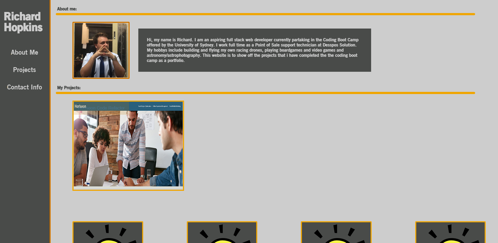

# My Portfolio Readme

## Description:

This repo contains the refactored version of the Horiseon web page. In refactoring this web page i have applied semantic html elements and css, consolidated code where possible, reformated code to make it more readable and commented code to describe what it does.

## Screenshoots of website:

## Link to live website:

[Link to Horiseon website](https://richardthopkins.github.io/MyPortfolio/)
